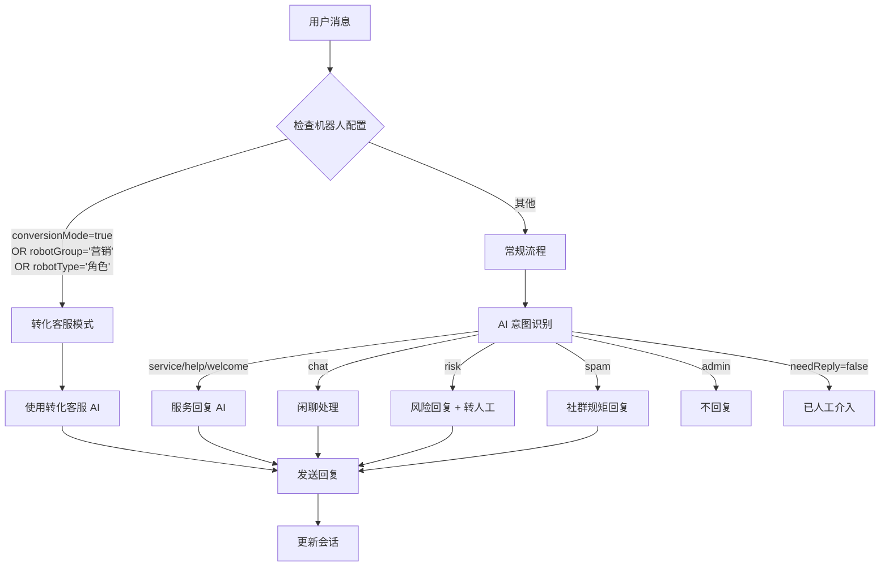

# 机器人角色快速参考

## 快速决策流程



## 触发条件速查表

| 条件 | 字段 | 值 | 效果 |
|------|------|-----|------|
| ✅ 转化客服 | `conversionMode` | `true` | 强制使用转化客服 AI |
| ✅ 转化客服 | `robotGroup` | `'营销'` | 强制使用转化客服 AI |
| ✅ 转化客服 | `robotType` | `'角色'` | 强制使用转化客服 AI |
| ❌ 常规流程 | 其他 | 任意 | 执行常规意图识别流程 |

## 常规意图类型速查表

| 意图类型 | 说明 | AI 模型 | 提示词类型 |
|---------|------|---------|-----------|
| `service` | 服务请求 | 服务回复 AI | `service` |
| `help` | 帮助请求 | 服务回复 AI | `service` |
| `welcome` | 欢迎 | 服务回复 AI | `service` |
| `chat` | 闲聊 | 闲聊 AI/固定 | `chat` |
| `risk` | 风险内容 | 风险回复 AI | `risk` |
| `spam` | 垃圾信息 | 垃圾回复 AI | `spam` |
| `admin` | 管理指令 | 无 | 无 |
| `report` | 报告 | 报告 AI | `report` |

## 常见配置示例

### 营销机器人（自动转化客服）
```javascript
{
  name: "营销推广机器人",
  robotGroup: "营销",
  robotType: null,
  conversionMode: false
}
```

### 角色机器人（自动转化客服）
```javascript
{
  name: "虚拟角色机器人",
  robotGroup: null,
  robotType: "角色",
  conversionMode: false
}
```

### 客服机器人（常规流程）
```javascript
{
  name: "客户服务机器人",
  robotGroup: "服务",
  robotType: "客服",
  conversionMode: false
}
```

### 技术支持机器人（常规流程）
```javascript
{
  name: "技术支持机器人",
  robotGroup: "技术支持",
  robotType: "助手",
  conversionMode: false
}
```

### 强制转化客服机器人
```javascript
{
  name: "自定义转化机器人",
  robotGroup: "自定义",
  robotType: "自定义",
  conversionMode: true  // 显式开启
}
```

## 关键日志关键字

**转化客服模式**：
- `检测到转化客服模式已启用`
- `检测到机器人分组为营销`
- `检测到机器人类型为角色`
- `使用转化AI回复`

**常规流程**：
- `AI 意图识别开始`
- `意图识别结果`
- `使用服务回复模型`
- `闲聊模式`
- `检测到风险内容`

## 数据库操作速查

### 查看机器人配置
```sql
SELECT
  id,
  name,
  robot_group,
  robot_type,
  conversion_mode,
  is_active
FROM robots;
```

### 设置营销分组
```sql
UPDATE robots
SET robot_group = '营销'
WHERE id = '机器人ID';
```

### 设置角色类型
```sql
UPDATE robots
SET robot_type = '角色'
WHERE id = '机器人ID';
```

### 开启转化客服模式
```sql
UPDATE robots
SET conversion_mode = true
WHERE id = '机器人ID';
```

### 批量配置
```sql
-- 将所有营销分组机器人设置为客服类型
UPDATE robots
SET robot_type = '客服'
WHERE robot_group = '营销';

-- 将所有客服机器人开启转化客服模式
UPDATE robots
SET conversion_mode = true
WHERE robot_type = '客服';
```

## 系统配置位置

### 1. 机器人管理
**路径**：`/admin/robots`
**功能**：查看和编辑机器人配置

### 2. 系统设置
**路径**：`/admin/settings`
**AI 模型配置**：
- 意图识别
- 服务回复
- 闲聊
- 转化客服
- 报告

### 3. Prompt 训练
**路径**：`/admin/prompt-training`
**提示词类型**：
- `service` - 服务回复
- `chat` - 闲聊
- `conversion` - 转化客服
- `risk` - 风险回复
- `spam` - 垃圾信息
- `report` - 报告生成

## 常见问题

### Q: 如何让机器人使用转化客服 AI？
**A**: 满足以下任一条件即可：
1. 设置 `robot_group = '营销'`
2. 设置 `robot_type = '角色'`
3. 开启 `conversion_mode = true`

### Q: 转化客服模式和常规流程有什么区别？
**A**:
- **转化客服**：跳过意图识别，直接使用专门 AI
- **常规流程**：先进行意图识别，再根据意图选择处理方式

### Q: 可以同时启用多个转化客服条件吗？
**A**: 可以，但只会执行一次转化客服处理（优先级：conversionMode > robotGroup > robotType）

### Q: 如何查看机器人当前的处理模式？
**A**: 查看日志，搜索关键词：
- 转化客服：搜索 `使用转化AI回复`
- 常规流程：搜索 `意图识别结果`

### Q: 转化客服 AI 可以使用不同的模型吗？
**A**: 可以，在系统设置 > AI 模型配置 > 转化客服中配置

## API 端点

### 获取机器人列表
```bash
GET /api/admin/robots
```

### 更新机器人配置
```bash
PUT /api/admin/robots/:id
Content-Type: application/json

{
  "robotGroup": "营销",
  "robotType": "角色",
  "conversionMode": true
}
```

### 获取系统配置
```bash
GET /api/admin/config
```

### 更新系统配置
```bash
POST /api/admin/config
Content-Type: application/json

{
  "ai": {
    "conversion": {
      "useBuiltin": true,
      "builtinModelId": "doubao-seed-1-8-251228"
    }
  }
}
```

## 性能指标

| 指标 | 转化客服模式 | 常规流程 |
|-----|------------|---------|
| 意图识别 | ❌ 不需要 | ✅ 需要 |
| 响应速度 | ⚡ 快 | 🐌 较慢 |
| 处理步骤 | 3-5 步 | 8-10 步 |
| AI 调用次数 | 1 次 | 1-2 次 |
| 适用场景 | 营销/转化 | 服务/客服 |

## 最佳实践

1. **营销场景**：设置 `robotGroup = '营销'`，使用转化客服模式
2. **客服场景**：设置 `robotType = '客服'`，使用常规流程
3. **角色扮演**：设置 `robotType = '角色'`，使用转化客服模式
4. **技术支持**：设置 `robotGroup = '技术支持'`，使用常规流程
5. **自定义场景**：开启 `conversionMode = true`，强制使用转化客服

## 相关文档

- [机器人角色设计文档](./ROBOT_ROLE_DESIGN.md)
- [机器人角色测试文档](./ROBOT_ROLE_TEST.md)
- [系统配置指南](./SYSTEM_CONFIG.md)
- [Prompt 训练指南](./PROMPT_TRAINING.md)
